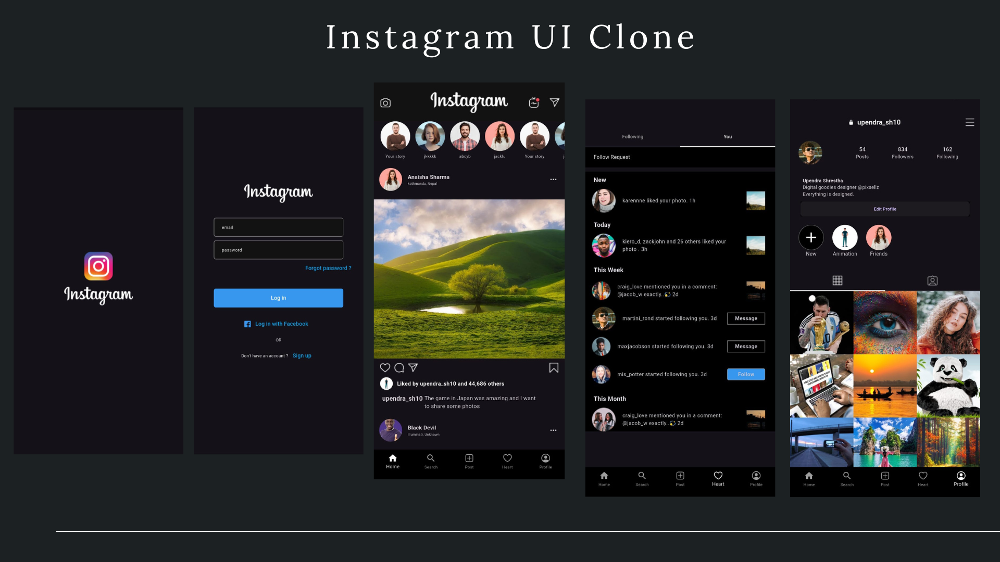

# instaclone

A modern Instagram Clone built using Flutter.
This project replicates the core UI and features of Instagram including feed, stories, posts, likes, and user profiles.

## 🛠 Tech Stack
- 💙 **Flutter** – Cross-platform UI framework  
- 🎯 **Dart** – Programming language  
- 🎨 **Figma** – UI/UX Design & Prototyping  

## 🛠 ScreenShots

